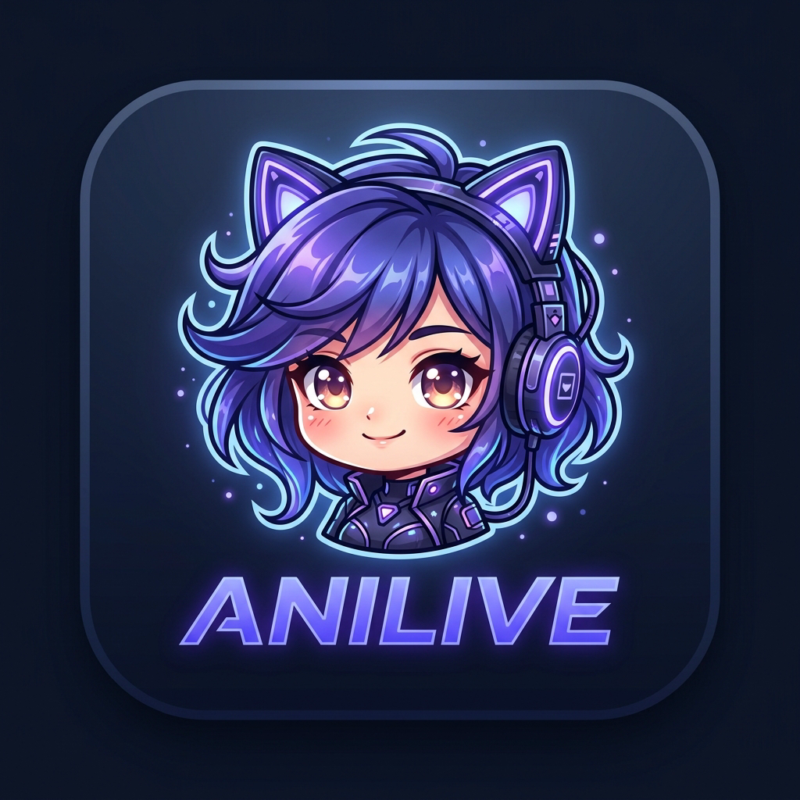
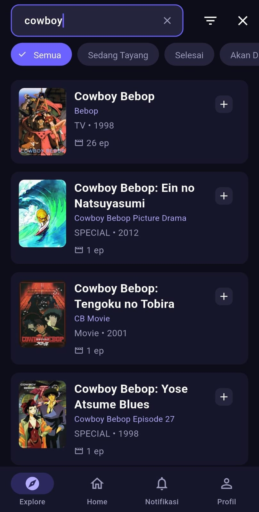
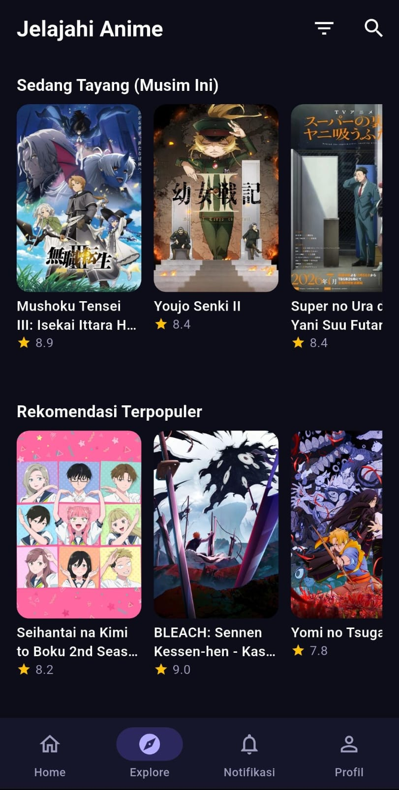
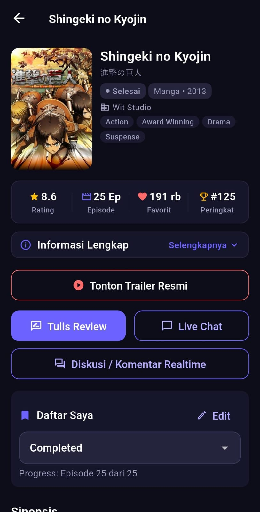
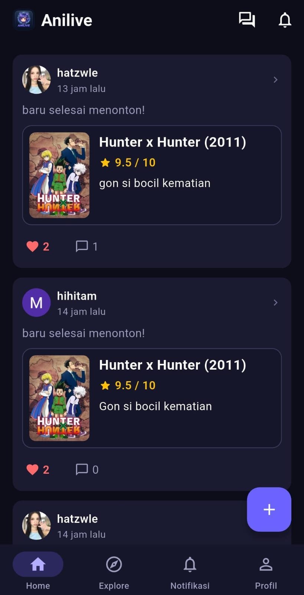
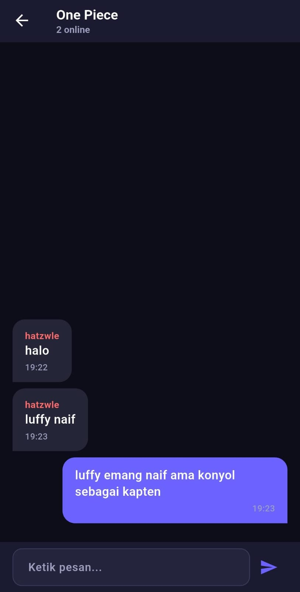
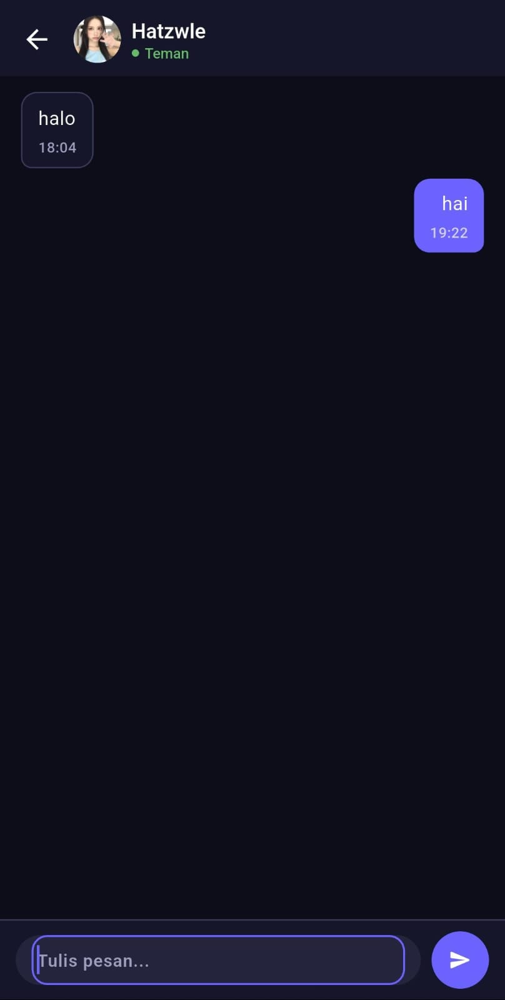
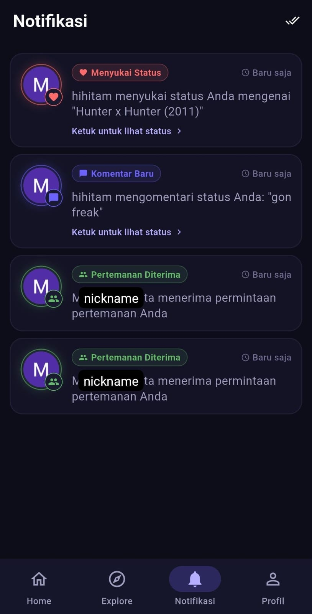
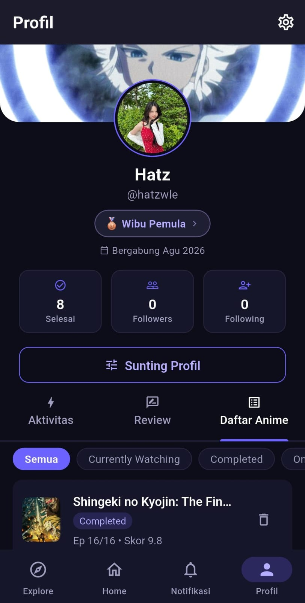

<p align="center">
  
</p>

<h1 align="center">Anilive — Anime Discovery, Social & Live Chat</h1>

<p align="center">
  <b>Aplikasi Flutter modern (Dark-first, Material 3) untuk eksplorasi anime, pencarian semantik AI cerdas (RAG), ruang live-chat per anime, direct message antar teman, serta jejaring sosial komunitas otaku.</b>
</p>

<p align="center">
  
  
  
  
  
  
</p>

---

## 📱 Tampilan Visual Antarmuka (Showcase UI)

Antarmuka dirancang dengan **Material 3 Design System** berorientasi *Dark-Only*, tipografi terkurasi, dan palet warna kontras tinggi yang nyaman di mata:

| 🔍 Pencarian Semantik AI (RAG) | 🧭 Halaman Explore & Genre |
| :---: | :---: |
|  |  |
| *Pencarian bahasa alami & rekomendasi pintar* | *Katalog populer, rekomendasi musiman & genre* |

| 🎬 Detail Komprehensif Anime | 📰 Komunitas & Feed Status |
| :---: | :---: |
|  |  |
| *Sinopsis, episode, karakter, lagu tema, & ulasan* | *Bagikan momen tontonan, interaksi, & tanggapan* |

| 💬 Live Chat Komunitas Anime | ✉️ Private Chat (Direct Message) |
| :---: | :---: |
|  |  |
| *Obrolan publik langsung per judul anime* | *Pesan langsung privat real-time antar teman* |

| 🔔 Pusat Notifikasi Terpadu | 👤 Profil & Kustomisasi GIF |
| :---: | :---: |
|  |  |
| *Pemberitahuan interaksi, like, dan permintaan teman* | *Banner profil GIF via Giphy, bio kustom, & koleksi* |

---

## ✨ Fitur Unggulan

### 1. 🤖 Pencarian Semantik Berbasis AI (RAG Pipeline)
- **Natural Language Query**: Cari anime cukup dengan mendeskripsikan jalan cerita (misal: *"anime tentang detektif yang tubuhnya mengecil"* atau *"karakter berambut pirang punya rubah ekor sembilan"*).
- **Hybrid Grounding**: Menggabungkan kecerdasan LLM (*Together AI / LLaMA-3*) dengan pencocokan database lokal 30.000+ anime nyata.
- **Instant Response Caching**: Hasil query semantik disimpan dalam multi-tier cache (Memory & Local Storage) sehingga pencarian berikutnya merespons instan (0 ms).

### 2. ⚡ Arsitektur Database Offline-First
- **Database Lokal Terbina**: Membawa database awal 30.000+ anime yang siap ditelusuri seketika tanpa koneksi internet.
- **Smart Cloud Synchronization**: Terhubung mulus ke **Supabase** untuk sinkronisasi review, bookmark, dan cache detail baru saat online.

### 3. 💬 Ruang Obrolan Realtime & Direct Messaging
- **Live Chat Per Judul**: Diskusikan anime favorit Anda secara langsung bersama penonton lain dalam channel interaktif.
- **Private Chat (Direct Message)**: Kirim pesan langsung satu-lawan-satu dengan teman yang saling terhubung.
- **Realtime Listener**: Didukung Supabase Realtime WebSocket untuk pengiriman dan penerimaan pesan tanpa delay.

### 4. 🌐 Komunitas, Status Feed & Pertemanan
- **Post Status & Quotes**: Bagikan ulasan pendek atau update tontonan Anda ke beranda.
- **Nested Comments**: Berinteraksi dengan balasan komentar bertingkat dan tombol like.
- **Sistem Pertemanan**: Tambahkan teman, konfirmasi atau tolak permintaan pertemanan dari layar notifikasi.

### 5. 🎨 Personalisasi Profil & Integrasi Giphy
- **Banner Profil GIF Dinamis**: Pasang banner animasi favorit langsung dari mesin pencari **Giphy API** atau unggah langsung dari galeri lokal.
- **Biodata & Tautan Sosial**: Tampilkan bio, akun media sosial, daftar anime yang telah ditonton, serta koleksi favorit Anda.

### 6. 🛡️ Moderasi & Keamanan Konten
- **Penyaringan Otomatis**: Sensor otomatis untuk kata-kata kasar dan teks tidak pantas.
- **Sistem Pelaporan**: Fitur pelaporan konten untuk menjaga ekosistem komunitas tetap sehat dan kondusif.

---

## 🛠️ Arsitektur & Teknologi

Proyek ini dibangun mengikuti prinsip **Feature-First Clean Architecture** dengan pemisahan domain yang jelas:

```
lib/
├── core/                        # Modul inti & infrastruktur bersama
│   ├── config/                  # AppConfig (Environment & API URLs)
│   ├── services/                # Supabase, Moderasi, Notifikasi
│   └── theme/                   # Single Source of Truth AppTokens (Colors, Typography, Spacing)
└── features/                    # Modul per fitur (Data, Domain, Presentation)
    ├── anime/                   # Katalog, AniList/Jikan API, SQLite Cache, RAG Search
    ├── auth/                    # Supabase Auth, Google OAuth, Profil Biodata
    ├── chat/                    # Livechat per Anime & Private Direct Messaging
    ├── comment/                 # Komentar anime
    ├── notification/            # Notifikasi realtime & Friend requests
    ├── profile/                 # Profil pengguna, Giphy Banner Picker
    ├── review/                  # Sistem review dan rating bintang
    └── social/                  # Feed status, Like, Friendship Repository
```

### Tech Stack Utama:
- **Framework**: [Flutter](https://flutter.dev) (Dart 3.x)
- **State Management**: [Riverpod](https://riverpod.dev)
- **BaaS (Backend-as-a-Service)**: [Supabase](https://supabase.com) (Auth, PostgreSQL DB, Realtime, Storage)
- **Local Persistence**: [sqflite](https://pub.dev/packages/sqflite) & [shared_preferences](https://pub.dev/packages/shared_preferences)
- **AI / LLM Provider**: Together AI (Meta LLaMA-3)
- **Eksternal API**: AniList GraphQL, Jikan (MyAnimeList REST API v4), Giphy API
- **Networking**: [Dio](https://pub.dev/packages/dio) & Http
- **Routing**: [go_router](https://pub.dev/packages/go_router)

---

## 🚀 Panduan Memulai (Getting Started)

### Prasyarat:
1. Telah menginstal **Flutter SDK** (versi 3.19 ke atas disarankan) dan **Dart SDK**.
2. Telah mengonfigurasi **Android Studio / Xcode** untuk emulator atau perangkat fisik.
3. Memiliki akun dan proyek aktif di **Supabase**.

---

### Langkah 1: Kloning Repositori
```bash
git clone https://github.com/<username>/<nama-repo>.git
cd AnimeLive
```

### Langkah 2: Setup Database Supabase
1. Masuk ke **Supabase Dashboard** proyek Anda.
2. Buka menu **SQL Editor**.
3. Buka file [`supabase_schema.sql`](supabase_schema.sql) yang tersedia di root proyek ini, lalu salin dan jalankan seluruh query SQL di dalamnya.
4. Pastikan tabel `profiles`, `status_updates`, `friendships`, `direct_messages`, `anime_reviews`, `live_messages`, `notifications`, dan bucket storage sudah terbuat secara otomatis.

---

### Langkah 3: Konfigurasi File Environment (`.env`)
Proyek ini menggunakan sistem konfigurasi aman tanpa menyertakan kredensial sensitif ke Git.

1. Salin template `.env.example` menjadi `.env`:
   ```bash
   # Windows PowerShell
   Copy-Item .env.example .env

   # Linux / macOS
   cp .env.example .env
   ```

2. Buka file `.env` dan lengkapi nilai API keys Anda:
   ```env
   SUPABASE_URL=https://<project-ref>.supabase.co
   SUPABASE_ANON_KEY=<anon-public-key>
   GOOGLE_WEB_CLIENT_ID=<client-id>.apps.googleusercontent.com
   LLM_API_KEY=<together-ai-api-key>
   GIPHY_API_KEY=<giphy-api-key>
   ```
   > 💡 *Catatan: Jika API key belum diisi, aplikasi tetap dapat dijalankan dalam mode offline mock.*

---

### Langkah 4: Unduh Dependensi & Jalankan Aplikasi
```bash
# Ambil dependensi pub
flutter pub get

# Jalankan aplikasi dengan membawa konfigurasi .env
flutter run --dart-define-from-file=.env
```

---

## 🔒 Kebijakan Keamanan (Security Policy)

Proyek ini dirancang dengan standar keamanan data:
- **Zero Secrets in Git**: File `.env`, keystore, signing credentials, serta `google-services.json` / `GoogleService-Info.plist` secara ketat dikecualikan dari Git melalui `.gitignore`.
- **Row Level Security (RLS)**: Seluruh tabel di Supabase diproteksi menggunakan aturan RLS agar pengguna hanya dapat memodifikasi data miliknya sendiri.
- **Client Fallback**: Jika layanan cloud tidak terhubung, aplikasi beralih ke mode offline lokal yang aman tanpa memicu crash.

---

## 📄 Lisensi

Didistribusikan di bawah Lisensi MIT. Silakan gunakan dan kembangkan sesuai kebutuhan Anda.
